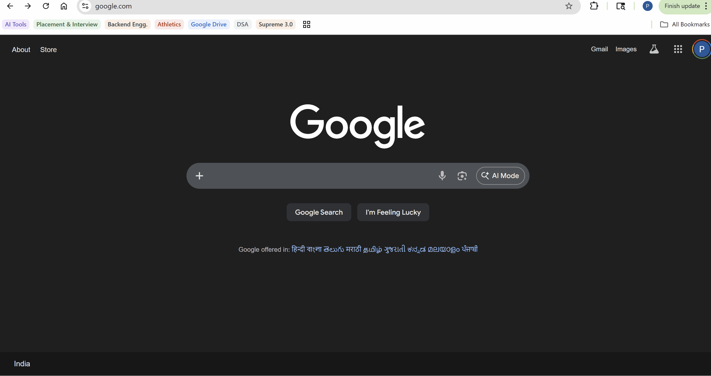
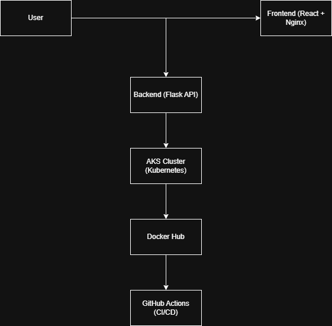

⭐ If you like this project, give it a star!

<h1 align="center">🚀 Three-Tier DevOps Project</h1>
<h3 align="center">AKS • Docker • Kubernetes • CI/CD • Azure</h3>

<p align="center">
  
  
  
  
</p>

---

## 📌 Project Overview

A **production-ready three-tier architecture** deployed on **Azure Kubernetes Service (AKS)** using modern DevOps practices.

🔹 React frontend (served via Nginx)  
🔹 Flask backend (REST API)  
🔹 Fully containerized using Docker  
🔹 Automated CI/CD using GitHub Actions

---

## 🎬 Live Demo

👉 Frontend: http://20.204.242.51  
👉 Backend: http://20.219.240.243:5000

> ⚠️ Note: External IPs may change if the Kubernetes service is restarted.  
> Please check latest service IP using:
> `kubectl get svc`

<p align="center">
  
</p>

---

## 🏗️ Architecture Diagram

<p align="center">
  
</p>

---

## 🏗️ Architecture

- **Frontend (UI Layer)**: React.js (served via Nginx)
- **Backend (API Layer)**: Flask REST API
- **Infrastructure**: Azure Kubernetes Service (AKS)
- **CI/CD**: GitHub Actions
- **Containerization**: Docker

---

## ⚙️ Tech Stack

<p align="center">
  
</p>

---

## 📁 Project Structure

```bash
three-tier-aks-devops/
├── frontend/              
├── backend/               
├── k8s/                   
├── .github/workflows/     
├── assets/                
└── README.md
```

---

## ☁️ Deployment (AKS)

- Created AKS cluster using Azure CLI
- Deployed applications using Kubernetes Deployments
- Exposed services using LoadBalancer
- Managed networking and service communication

---

## 🔄 CI/CD Pipeline

✔️ Build Docker images
✔️ Push to Docker Hub
✔️ Deploy to AKS

---

## 🚀 Key Features

- Scalable microservices architecture
- Automated CI/CD pipeline
- Cloud-native deployment (AKS)
- Real-world debugging & troubleshooting

---

## 🧠 Key Learnings

- Kubernetes networking & services
- Debugging:
    - Service port mismatch
    - CORS issues
    - ImagePullBackOff
- CI/CD automation
- AKS deployment

---

## 🚀 Run Locally

### Step 1: Clone repository
```bash
git clone https://github.com/prashantyadav8814/three-tier-aks-devops.git
cd three-tier-aks-devops
docker compose up --build
```

### Step 2: Access application
```bash
- Frontend: http://localhost:3000
- Backend: http://localhost:5000
```

---

## 🐳 Docker Images

- Frontend: https://hub.docker.com/r/prashantyadav8814/frontend
- Backend: https://hub.docker.com/r/prashantyadav8814/backend

---

### ❗ Issues Faced & Fixes

1. Frontend not loading via LoadBalancer  
   - Cause: Service port mismatch (3000 vs 80)  
   - Fix: Updated Kubernetes Service to use port 80  

2. External IP not accessible  
   - Cause: Incorrect service configuration  
   - Fix: Recreated LoadBalancer service  

3. Frontend not calling backend  
   - Cause: Used `localhost` inside container  
   - Fix: Replaced with Kubernetes service name (`backend:5000`)  

4. Backend response not visible  
   - Cause: CORS issue  
   - Fix: Enabled CORS in Flask backend

---

## 🚧 Future Improvements

- Ingress Controller
- HTTPS (SSL)
- Azure Container Registry
- Monitoring (Prometheus + Grafana)

---

## 👨‍💻 Author
Prashant Yadav
